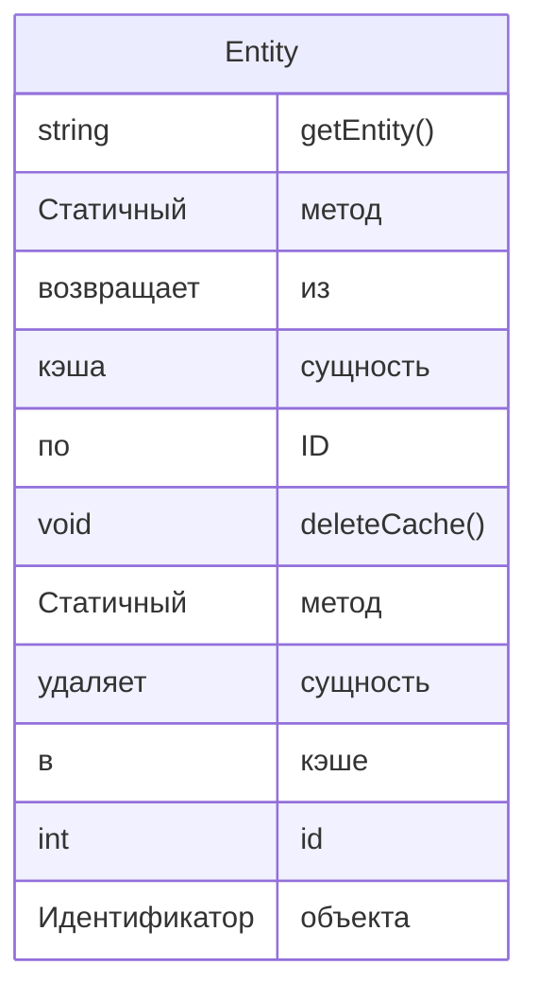

# Entity

Базовый класс сущностей данных CPM

```mermaid
erDiagram
Entity {
    string  getEntity()     Статичный метод возвращает из кэша сущность по ID
    void    deleteCache()   Статичный метод удаляет сущность в кэше
    int     id              Идентификатор объекта
}
```
